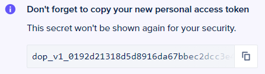

# my-brain
This is my Obsidian vault for term 2

>[!IMPORTANT]
>
>Once you've finished those steps, your token will be generated and you'll be given a token string. The token string will be shown to you only **once**. Ensure you copy it and store it in a safe place as you'll need it to authenticate `doctl`.